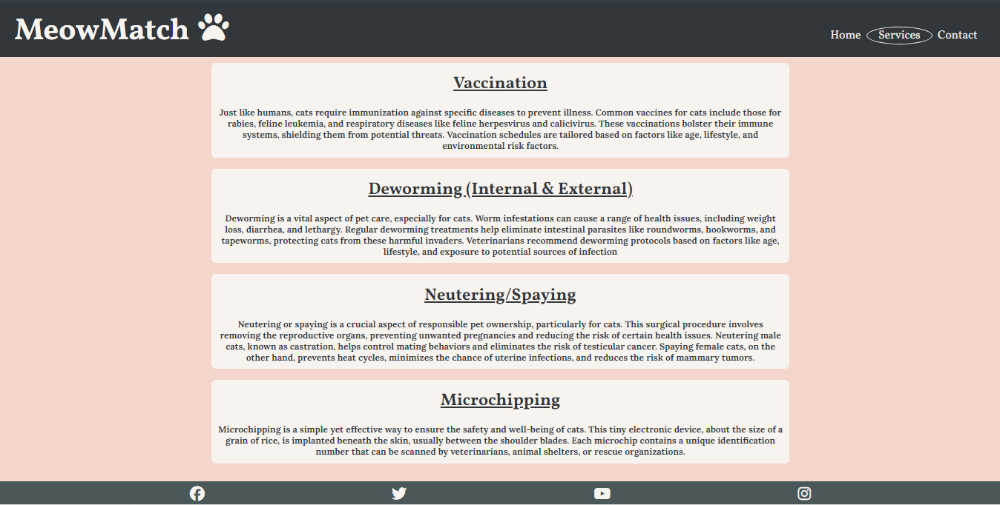

# MeowMatch

Welcome to MeowMatch! This website is aimed at people that are looking for a little fluffy best friend. Cats are known for their independent personalities and health-related benefits. They are gorgeous, little balls of fluff that need love and care. We here at MeowMatch are aiming to provide to each and every one of these little souls a forever home with their new family. 

We highly encourage you to contact us, whether you're looking for a playful kitten or a wise older cat, because we believe that every cat deserves a loving and caring home. 

# Table of Contents
1. **[Target Audience](#target-audience)**
   * [User Stories](#user-stories)
   * [User Goals](#user-goals)
   * [Business Goals](#business-goals)
2. **[Design](#design)**
   * [Color Scheme](#color-scheme)
   * [Typography](#typography)
       + [Lora](#lora)
       + [Vollkorn](#vollkorn)
   * [Imagery](#imagery)
   * [Wireframes](#wireframes)
       + [Home Page](#home-page)
       + [Services Page](#services-page)
       + [Contact Page](#contact-page)
       + [Mobile View](#mobile-view)
3. **[Features](#features)**
   * [General Features](#general-features)
       + [Navigation Bar](#navigation-bar)
       + [Footer Links](#footer-links)
   * [Features by Page](#features-by-page)
       + [Home Page](#home-page)
       + [Services Page](#services-page)
       + [Contact Page](#contact-page)
   * [Future Implementations](#future-implementations)
   * [Accessibility](#accessibility)
4. **[Technologies Used](#technologies-used)**
5. **[Languages Used](#languages-used)**
6. **[Deployment & Local Development](#deployment--local-development)**
   * [Deployment](#deployment)
   * [Local Development](#local-development)
       + [How to Clone](#how-to-clone)
       + [How to Fork](#how-to-fork)
7. **[Testing](#testing)**
   * [Validation](#validation)
       + [HTML Validator](#html-validator)
       + [CSS Validator](#css-validator)
       + [Lighthouse](#lighthouse)
   * [Accessibility](#accessibility)
   * [Devices Used](#devices-used)
       + [Laptops](#laptops)
       + [Mobile Devices](#mobile-devices)
       + [Browsers Used](#browsers-used)
   * [Full Testing](#full-testing)
   * [Bugs](#bugs)
8. **[Credits](#credits)**
   * [Code Used](#code-used)
   * [Content](#content)
   * [Acknowledgements](#acknowledgements)

# Target Audience

This website is targeted at people who are on the lookout for a cat to adopt, whether they are families with children, couples of any age or people that live alone and want a furry and sweet companion. The website is simple to use, it contains testimonies from previous clients that adopted through us, a gallery with some of the cats we have in the shelter and a section with a form where the user can complete and send to the shelter.

## User Stories

* As an animal lover, I am looking for a website that can offer options to pick a forever friend, as well as guidance towards the best care I can offer to my new pet. 

* As a visitor, I am looking for a simple, yet resourceful website where I can learn more about cats. This includes a user-friendly design and a contact form in order to find out more information.

## User Goals

1. Easy and responsive website helps the customer navigate the adoption process no matter what devices they're using by using media queries and flexbox containers
2. The page is filled with useful information the customer would need before taking this important step for both them and the cats  
3. Customers can always get in touch with the shelter for further inquiries using the form in the "Contact" page

## Business Goals

1. To help households and people adopt a loving pet
2. Raise awareness on animal abandonment and encourage adopting instead of buying a pet
3. Offer mistreated or abandoned animals a second chance for a better life

# Design

## Color Scheme

The color scheme is a fairly simple one, as the main focus should be on the cats and on the information regarding our services and potential pets. The white is used on the title and social network icons in order to contrast the dark background, whereas the body of the website itself is pale pink as the website contains many images of cats; this is so the website isn't overloaded with content.

## Typography

For the fonts I've chosen Lora and Vollkorn for an elegant feel to the webpage. Below there is a screenshot of both fonts:

### Lora

### Vollkorn

## Imagery

All the images were taken from pexels.com. The images are impactful in order to deliver the message about the importance of adoption and also the sad reality that comes with animal abandonment/mistreatment.

## Wireframes

I used Balsamiq to create the wireframes. These wireframes were designed before the actual construction of the website. While building the website, I would see a better way to implement information and graphics and apply those instead. The wireframes were very helpful to get an initial idea of how I'd want the webpage to look like, but have since strayed for a better user-friendly website. 

### Home Page

### Services Page

### Contact Page

### Mobile view

# Features

## General Features

### Navigation Bar

A navigation bar is featured on all three pages for ease of use and accessibility. There are two different versions of the navbar depending on whether you're navigating the website on mobile or desktop, hence adding responsiveness to the webpage. The active page is shown by having an oval around the text.

Desktop navigation bar

Mobile navigation bar

Screenshot of the opened navigation bar

### Footer Links

There are links to social media websites included on every page, the icons were taken from Font Awesome and I've attributed them the white color for a nice aesthetic feel.

## Features by Page

### Home Page

The home page has the "About" section at the top of the page. The "About" section is describing the purpose of the website and encourages the user to explore the website. Scrolling down there is a small gallery of cats that are put up for adoption through the website alongside with a short description about each cats' personality, so the user can have an idea about the specific cats' behaviour. At the bottom of the page there are positive client reviews that have previously adopted through the website and were delighted with their newfound friends; this gives the user trust into the shelter.

### Services Page

The services page contains the price list that the shelter offers in order to help the new owner assure that their new pet has all of the necessary vaccines and medical procedures done before going to their new forever home. This helps the user not consider adoption an overwhleming process by letting the shelter take over when it comes to medical procedures. Below the table there is a description about every service provided and why it's a good (and absolutely necessary) thing to do in order to have a healthy pet. At the bottom of the page there is a gallery of cats of all ages around the shelter.

### Contact Page

The contact page includes a simple contact form for possible clients and/or people that want to enquire about the cats that are in the shelter. All the fields are required to be completed in order for the form to be sent to the staff. There is also a "Reset" button to reset the form details. Below the contact form there is a table containing the opening hours, important information like the address, phone numbers and email address. There is also an embed map from Google Maps that pinpoints the location of the shelter. All this information helps the user find the place and can count on the staffs' availability for enquiries.

## Future Implementations

* Ideally I'd implement a donation section where people who love animals but maybe don't have the possibility to adopt can donate so the shelter can continue to provide the best care for the cats.
* A larger database containing information about the cats that are cared for at the shelter.
* A blog section where people can read about the successes and subsequent struggles that come with looking after the shelter to raise awareness.

## Accessibility

* I have used aria-labels everywhere I could for screen readers
* All images have alt-descriptions
* The HTML contains a lot of semantic elements for an easy-to-follow structure

# Technologies Used

* **Gitpod** - The IDE where all the coding and commits have been done
* **GitHub** - Where the website is stored and pushed. The website was deployed early via GitHub and it was constantly tested
* **HTML5** - The main structure of the website was created using HTML5
* **CSS** - This was used in order to style the webpage in way that is pleasing to the eye
* **Python** - Python3 was used to preview the website on a local http server
* **Balsamiq** - To create the wireframes
* **Google Maps** - The map was taken from Google Maps Inc.
* **Google Chrome** - All the testing and building took place using Google Chrome
* **Font Awesome** - All the icons except for the one in browser tab were taken from Font Awesome
* **Favicon** - The icon in the browser tab was taken from Favicon
* **ImageResizer** - This webiste was used to compress images
* **DevTools** - Using Google Chromes' DevTools helped me play with the code to find the best properties for my webpage
  
## Languages Used

* **HTML**
* **CSS**

# Deployment & Local Development

## Deployment
I deployed the website through GitPages.

## Local Development

### How to Clone
1. Log into your account on github
2. Go to the repository of this project /petra66orii/meowmatch/
3. Click on the code button, and copy your preferred clone link.
4. Open the terminal in your code editor and change the current working directory to the location you want to use for the cloned directory.
5. Type 'git clone' into the terminal, paste the link you copied in step 3 and press enter.

### How to Fork
To fork the repository:
1. Log in (or sign up) to Github.
2. Go to the repository for this project, petra66orii/meowmatch
3. Click the Fork button in the top right corner.

# Testing

## Validation

### HTML Validator
Every page was validated through the official W3C website.

### CSS Validator
The style.css file was validated by using both the official Jigsaw and the W3C validator.

### Lighthouse

I used DevTools' Lighthouse on Google Chrome for the testing and I was slightly upset to see that the performance was significantly lower than expected. One of the reasons the tester was implying was that I had installed a good few Chrome extensions which are subsequently slowing down the performance, and recommended I used Incognito mode for a fairer test, but it was still very low. 

Further feedback from Lighthouse suggested that the images used within the website were very large and hence were affecting the performance. So, I've used the free **imageresizer** website to resize the images while maintaining their quality. The results were ok after that, performance-wise. 

I've received a "Best Practices" score of 78 on the contact.html page because the form didn't contain an HTTPS connection. Since this website only requires HTML & CSS code, this problem is beyond the scope of the project and subsequently will be left as such.

## Accessibility

When I first tested the accessibility on the webiste using Wave, I got this error. 

This was because the label and input weren't used for their intended purpose. The fix was easy, though: an aria-label was applied to the `<label>` tag and the error was fixed.

## Devices Used 
Testing was done on the following devices: 

### Laptops
* HP ProBook
* Acer Aspire E15
* Asus GL702Z

### Mobile Devices
* iPhone 11
* Samsung Galaxy Flip 5
* Samsung Galaxy S10

### Browsers Used
Each device used the following browsers for testing:

* Google Chrome
* Microsoft Edge
* Safari (Mobile only)
* Samsung Internet (Mobile only)

## Full Testing

| Feature | Expected Outcome | Testing Performed | Result | Pass/Fail |
| --- | --- | --- | --- | --- |
| `Navbar` |
|  |  |  |  |  |
| MeowMatch Logo & Title | When clicked the user will be redirected to the Home page | Clicked Logo and title | Redirected to the Home page | Pass |
| Home Page Link | When clicked the user will be redirected to the Home page | Clicked link | Redirected to the Home page | Pass |
| Services Link | When clicked the user will be redirected to the Services page | Clicked link | Redirected to the Services page | Pass |
| Contact Link | When clicked the user will be redirected to the Contact page. | Clicked link | Redirected to the Contact page | Pass |
| --- | --- | --- | --- | --- |
| `Footer` |
|  |  |  |  |  |
| Social Icons | When clicked the user will be redirected to the appropriate social media pages in a new window. | Clicked icon | Redirected to the social media page in a new window. | Pass |
| --- | --- | --- | --- | --- |
| `Services Page` |
|   |   |   |   |
| Gallery Responsiveness | When window was resized gallery was responsive and site layout looked as expected | Resized window | Gallery was responsive and looks good | Pass |
| --- | --- | --- | --- | --- |
| `Contact Page` |
|   |   |   |   |
| Google Map | Map should be interactive when clicked on | Clicked on map | Map zoomed in and reacted as expected | Pass |
| Contact Form | When items were left out the was a message asking to fill the section in | Clicked submit while leaving form unfillled | Form requested sections to be filled in | Pass |

 - - -

## Bugs

* The first bug I've encountered was that the footer wasn't fixed to the bottom of the webpage, and a line would show under the footer. Note that since the bug was discovered and fixed early, the screenshots shown don't represent the final product. 

This was an easy fix, as I only needed to set the position to 'fixed' and set the bottom to 0.

# Credits

## Code Used

* Footer content was borrowed and modified from the Love Running project
* Snippets of code were used from W3Schools (said code is highlighted in the comments within the code)

## Content

* Content was written by me with help from [ChatGPT](https://chatgpt.com) as well
* Fonts were taken from [Google Fonts](https://fonts.google.com/)
* Icon in the browser tab was taken from [Favicon](https://favicon.io/)
* Icon in the header was taken using [Font Awesome](https://fontawesome.com/)
* Color scheme was determined using [Coolors](https://coolors.co/)
* All the photos were taken from the royalty-free website [Pexels](https://pexels.com)
* I used [Stack OverFlow](https://stackoverflow.com) to solve some code-related problems 

## Acknowledgements

* I would like to thank my partner Gerry and my brother Eric for providing me feedback from the perspective of a user to make sure the website is working at its best.
* I would also like to thank my mentor Luke for giving honest feedback and guiding me to create a properly designed website.  
