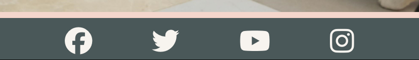

# MeowMatch

Welcome to MeowMatch! This website is aimed at people that are looking for a little fluffy best friend. Cats are known for their independent personalities and health-related benefits. They are gorgeous, little balls of fluff that need love and care. We here at MeowMatch are aiming to provide with each and every one of these little souls a forever home with their family. 

We highly encourage you to contact us, whether you're looking for a playful kitten or a wise older cat, because we believe that every cat deserves a loving and caring home. 

## Target Audience

This website is targeted at people who are on the lookout for a cat to adopt, whether they are families with children, couples of any age or people that live alone and want a furry and sweet companion. The website is simple to use, it contains testimonies from previous clients that adopted through us, a gallery with the cats that we have in the shelter and a section with a form to apply for adopting a cat.

## User Stories

* As an animal lover, I am looking for a website that can offer options to pick a forever friend, as well as guidance towards the best care I can offer to my new pet. 

* As a visitor, I am looking for a simple, yet resourceful website where I can learn more about cats. This includes a user-friendly design and a contact form in order to find out more information.

## User Goals

1. Easy and responsive website helps the customer navigate the adoption process no matter what devices they're using by using media queries and flexbox containers
2. The page is filled with useful information the customer would need before taking this important step for both them and the cats  
3. Customers can always get in touch with the shelter for further inquiries using the form in the "Contact" page

## Business Goals

1. To help households and people adopt a loving pet
2. Raise awareness on animal abandonment and encourage adopting instead of buying a pet
3. Offer mistreated or abandoned animals a second chance for a better life

## Design

### Color Scheme

The color scheme is a fairly simple one, as the main focus should be on the cats and on the information regarding our services and potential pets. The white is used on the title and social network icons in order to contrast the dark background, whereas the body of the website itself is pale pink as the website contains many images of cats; this is so the website isn't overloaded with content.

### Typography

For the fonts I've chosen Lora and Vollkorn for an elegant feel to the webpage. Below there is a screenshot of both fonts:

#### Lora

#### Vollkorn

### Imagery

All the images were taken from pexels.com. The images are impactful in order to deliver the message about the importance of adoption and also the sad reality that comes with animal abandonment/mistreatment.

### Wireframes

I used Balsamiq to create the wireframes.

#### Home Page

#### Services Page

#### Contact Page

#### Mobile view

## Features

### General features on all pages

#### Navigation Bar

A navigation bar is featured on all three pages for ease of use and accesibility. There are two different versions of the navbar depending on whether you're navigating the website on mobile or desktop, hence adding responsiveness to the webpage.

Desktop navigaion bar

Mobile navigation bar

Screenshot of the opened navigation bar

#### Footer Links

There are links to social media websites included on every page, the icons were taken from Font Awesome and I've attributed the same pale pink color that is present on the body of the website for added aesthetics.

## Technologies Used

* Gitpod - The IDE where all the coding has been done
* GitHub - Where the website is stored and all the updates are pushed on
* HTML5 - The main structure of the website was created using HTML5
* CSS - This was used in order to style the webpage in way that is pleasing to the eye
* Python - Python3 was used to preview the website on a local http server
* Balsamiq - To create the wireframes

## Languages Used

* HTML
* CSS

## Testing

Testing was done on the following devices: 

#### Laptop
* HP ProBook
* Acer Aspire E15
* Asus GL702Z

#### Mobile Devices
* iPhone 11
* Samsung Galaxy Flip 5
* Samsung Galaxy S10

### Bugs

* The first bug I've encountered was that the footer wasn't fixed to the bottom of the webpage, and a line would show under the footer. Note that since the bug was discovered and fixed early, the screenshots shown don't represent the final product. 

This was an easy fix, as I only needed to set the position to 'fixed' and set the bottom to 0.

## Credits

### Code Used

* Footer content was borrowed and modified from the Love Running project

### Content

* Fonts were taken from Google Fonts
* Icon in the browser tab was taken from Favicon
* Icon in the header was taken using Font Awesome
* Color scheme was determined using Coolors